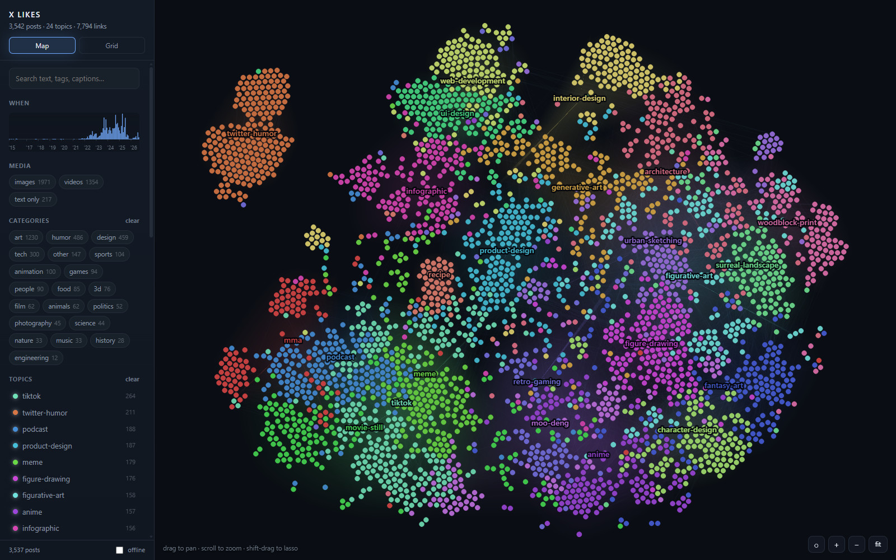
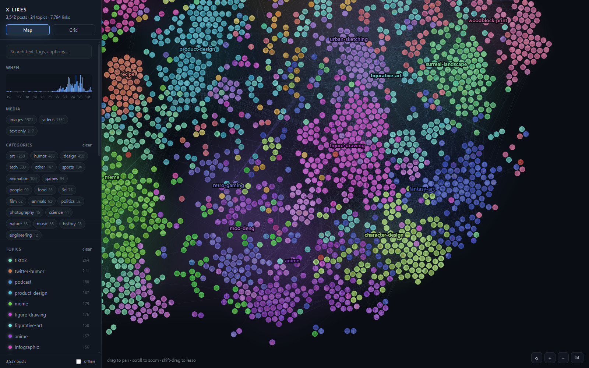
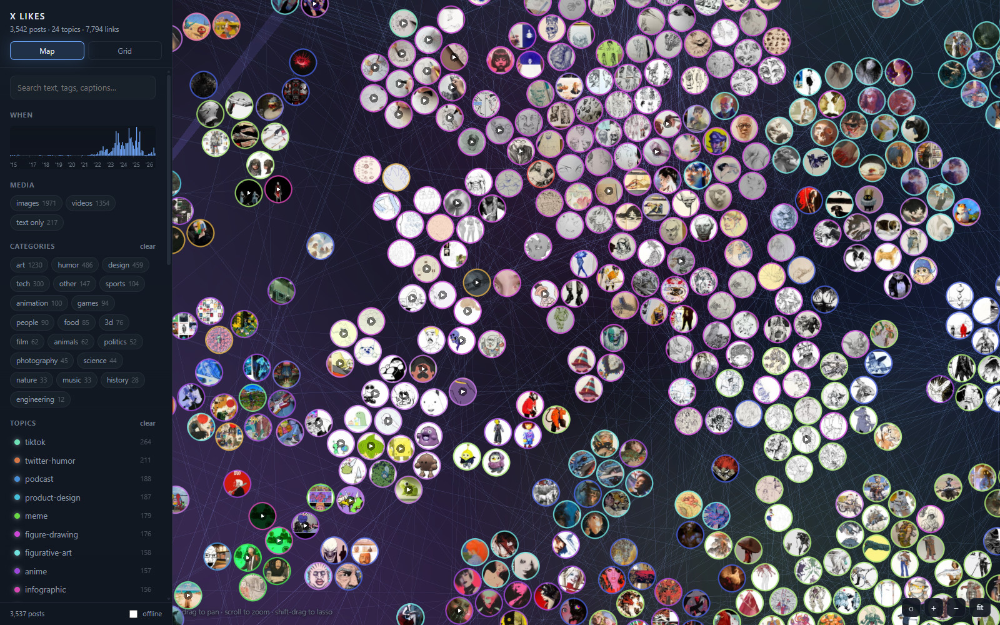
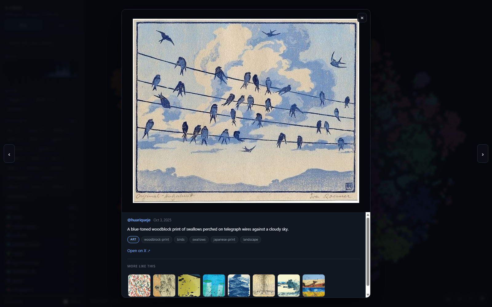
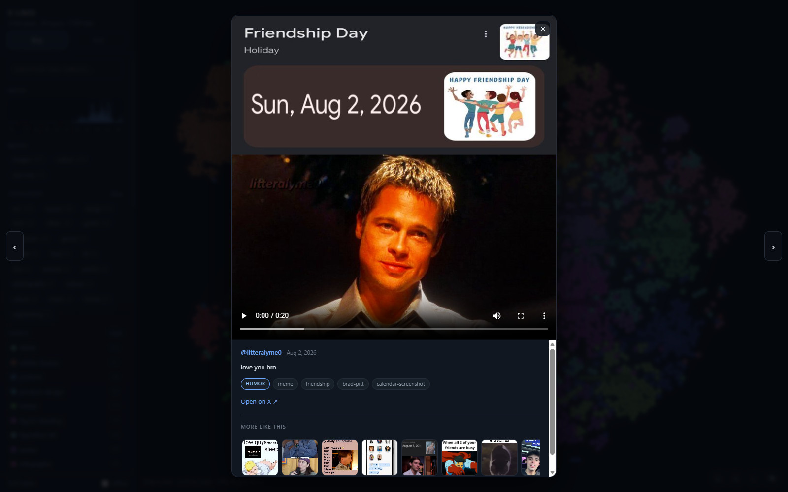

# X Likes Archive

Scrape your liked posts off X, then browse them by **what they are about** rather
than by who posted them or when.

A userscript pulls the posts and their media down. A local pipeline embeds every
one with CLIP, clusters them into topics, and (optionally) has Claude label them.
A local viewer then draws the whole archive as a map where related posts sit
together, and as a filterable grid.

Similarity is continuous, which is the point: a post that is both *art* and
*robots* genuinely lands between those two groups and links more strongly to
other art-robot posts than to plain art. Tags cannot express that; vectors can.



> This repo is the tooling only. Your likes, your media and everything derived
> from them stay on your machine — see [.gitignore](.gitignore).

## 1. Scrape

Install [`x-likes-media.user.js`](x-likes-media.user.js) in Tampermonkey, then:

* set Tampermonkey's **Download Mode** to **Browser API**, and point its download
  directory at the folder you want the archive in;
* **reload x.com after installing** — the script hooks `fetch`/`XMLHttpRequest` at
  `document-start` to catch video URLs, and without a reload those hooks miss the
  API responses that carry them;
* open your likes page and press **⬇ Download likes media**.

It scrolls until the page stops growing, saving images and videos to `media/` and
finally writing `likes.json`:

```json
{
  "id": "1234567890",
  "url": "https://x.com/someone/status/1234567890",
  "handle": "someone",
  "time": "2024-06-01T12:00:00.000Z",
  "text": "the tweet text, often empty",
  "images": ["https://pbs.twimg.com/media/XXXX?format=jpg&name=orig"],
  "video": { "mp4": "https://video.twimg.com/...mp4", "poster": "https://..." }
}
```

Videos are HLS in the DOM, so the mp4 URL has to be sniffed out of X's GraphQL
responses and matched back to the post by `id_str` — that is what the hooks are
for. Media belonging to a quoted tweet is skipped.

Put `likes.json` and `media/` in the project root, next to `tools/`.

## 2. Build

Each step writes a file the next one reads, and each is safe to re-run.

| step | command | writes |
|---|---|---|
| thumbnails | `python tools/fetch_thumbs.py` | `media/thumbs/` + `dims.json` |
| embeddings | `python tools/embed.py` | `embeddings.npy`, `embed_index.json` |
| topics + layout | `python tools/cluster.py` | `graph.json` |
| texture atlas | `python tools/atlas.py` | `media/atlas/` |
| labels *(optional, costs money)* | `python tools/label.py label --yes` | `labels.json` |
| rename topics | `python tools/rename_clusters.py` | updates `graph.json` |

Needs `torch`, `open_clip_torch`, `Pillow`, `numpy` (and `anthropic` for the
labelling step). A CPU-only torch build is fine — on a desktop CPU the embedding
pass takes a few minutes for a few thousand posts.

**Thumbnails** come from X's CDN at `?name=small`, plus the poster frame the
scraper recorded for each video, so nothing needs ffmpeg or any image resizing.
File sizes drop by two orders of magnitude, and the viewer never decodes a 1 MB
original to draw a 32px circle. Dimensions are recorded here too, which is what
stops the grid reflowing as images arrive.

**Embeddings** run CLIP (`ViT-B-32`, laion2b) over those thumbnails and over the
tweet text where there is any, blending 75/25 toward the image. Tweet text is
thin — in the archive this was built against, the median caption was 33
characters and 624 posts had none at all — so the picture has to carry the
signal.

**Topics** are k-means over the vectors, positioned with t-SNE, plus each post's
8 nearest neighbours (what "more like this" shows) and the strongest links as
edges. Cluster names come from a fixed concept vocabulary at this stage.

**The atlas** packs every thumbnail into one 4096×4096 sheet of 64px tiles, so
the WebGL map is a single texture and a single request rather than thousands of
each. Skip it and the map still works, it just has no pictures.

**Labels** are optional and cost real money. `label.py` sends each 256px
thumbnail to Claude through the Batches API (half price) and gets back a
category, topic tags and a one-line caption. It prints a per-model cost table and
spends nothing without `--yes`:

```
export ANTHROPIC_API_KEY=sk-ant-...      # never commit this
python tools/label.py estimate
python tools/label.py label --model claude-opus-5 --yes
```

Measured at roughly 740 input and 91 output tokens per post: about **$10.58**
batched on Opus 5, **$3.92** on Sonnet 5, **$1.42** on Haiku 4.5 for ~3,500
posts. Opus earns it here — it reads text *inside* images, so a screenshot of a
tier list comes back with the individual items named, and those captions become
searchable. The run is resumable: labelled posts are skipped, `label.py resume`
picks up a batch still in flight, and `label.py cancel` stops one.

`rename_clusters.py` then renames each topic from the tags Claude actually
assigned, scored by lift rather than raw frequency — otherwise half the map ends
up called "art".

## 3. View

Double-click **`Open X Likes.pyw`**. It starts the server and opens the viewer
as its own app window - no address bar, no tabs, its own taskbar entry - by
handing the URL to Chrome or Edge in `--app` mode. Closing that window stops the
server and quits. No terminal, and nothing to install.

For a Desktop and Start Menu shortcut with a proper icon:

```
python tools/make_shortcut.py --start
```

Then pin it to the taskbar and it behaves like any other app.

A detail that matters: the app window runs against its own browser profile under
`%LOCALAPPDATA%\x-likes-viewer`. Started against your normal profile, Chromium
would just tell the already-running copy to open a window and exit immediately,
taking the server down with it. The separate profile also means the window
remembers its size and position.

The viewer pings `/__alive` every couple of seconds and the launcher stops the
server a few seconds after those pings stop. Waiting on the browser process
instead does not work: Edge hands the window to a different process and the one
you started exits within seconds, which would kill the server while the window
was still opening.

If no Chromium-based browser is found it falls back to a normal tab plus a small
window to close when you are done.

From a terminal instead:

```
python tools/serve.py --open
```

Either way, use this rather than `python -m http.server`: that one handles a
single request at a time, and the viewer pulls thumbnails ten at a time, so
everything queues behind everything else. The port is chosen automatically from
8000 upward, so a second copy still launches.

**Map** — every post is a point placed by content similarity, so topics show up
as coloured islands. Zoom in and the points become the pictures themselves.



Zoom further and every circle is the post itself — the atlas means all of them
can carry their picture at once.



* drag to pan, scroll to zoom, **fit** re-frames everything
* click a topic in the sidebar to isolate and fly to it
* **shift-drag** (or the ◌ button) lassoes any group, then *view in grid* carries
  exactly that selection across
* rendered in **WebGL2** — one instanced draw call over the shared atlas, so
  every post can carry its thumbnail at any zoom. Add `?nogl` to force the
  canvas 2D renderer, which is also what runs if the context cannot be created.

**Grid** — the same archive and the same filters as a masonry wall, sorted by
date or by topic.

Both share every filter through the URL, so switching views keeps your place and
a copied link reopens exactly what you were looking at. Tags combine with
**all of** / **any of** — that is how you ask for art *and* robots. The timeline
under the search box brushes a date range and doubles as a readout of when you
liked whatever is on screen. `/` focuses search, `m` and `g` switch views, arrows
move through the open post.

Clicking a post opens it at the media's own aspect ratio — a portrait video gets
a narrow panel rather than slabs of black either side, a text-only post gets a
readable column. Posts with several images get a filmstrip. Underneath, **more
like this** is the eight nearest posts in CLIP space. Text-only posts have
text-only neighbours — they are embedded from words alone and sit apart from
everything with a picture — so those tiles show the text instead of an empty
frame.



The caption and tags above come from the labelling pass; **more like this** comes
from the vectors. Video posts play in place, with the same neighbours underneath.



Tick **offline** to stop the viewer falling back to X's CDN for anything that
failed to download.

## Notes

* If `scikit-learn`'s compiled extensions will not load (some Windows machines
  block them under Application Control), `tools/_algos.py` implements PCA,
  k-means and t-SNE against torch instead. Nothing else depends on sklearn.
* The map keeps text and the lasso on a 2D canvas above the WebGL one — shaders
  are the wrong tool for type.
* Re-run `tools/atlas.py` after any new scrape, or newly added posts show as
  plain coloured dots.
* `labels.json` is the one artifact you pay for. It is gitignored, so keep a
  backup before re-running anything that could overwrite it.

## License

MIT — see [LICENSE](LICENSE).
